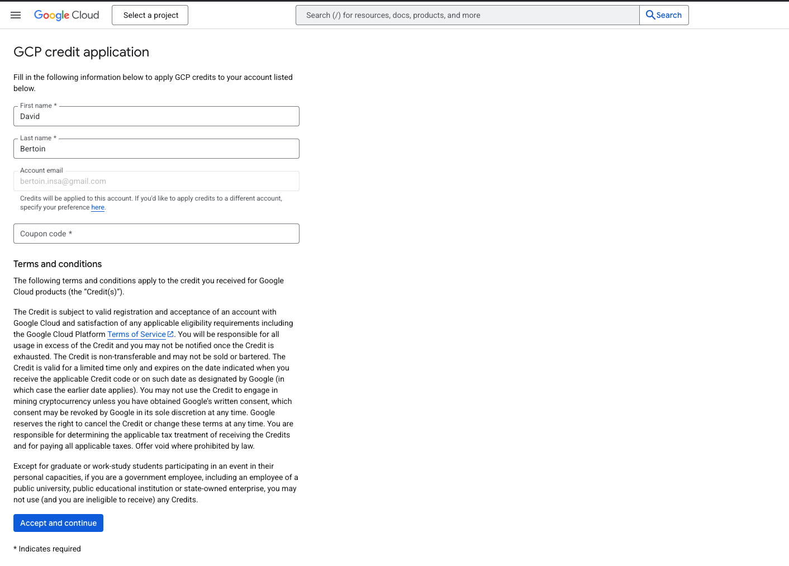
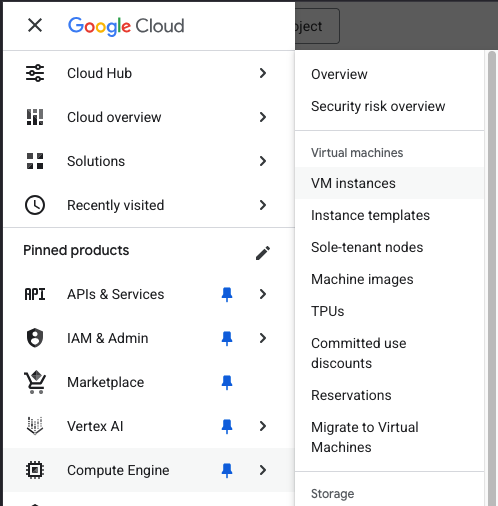
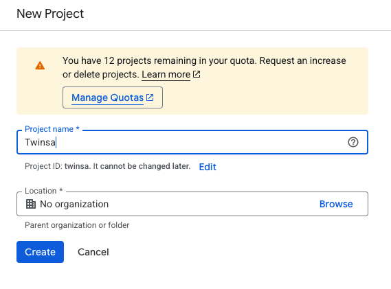
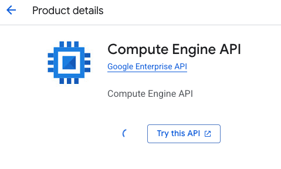
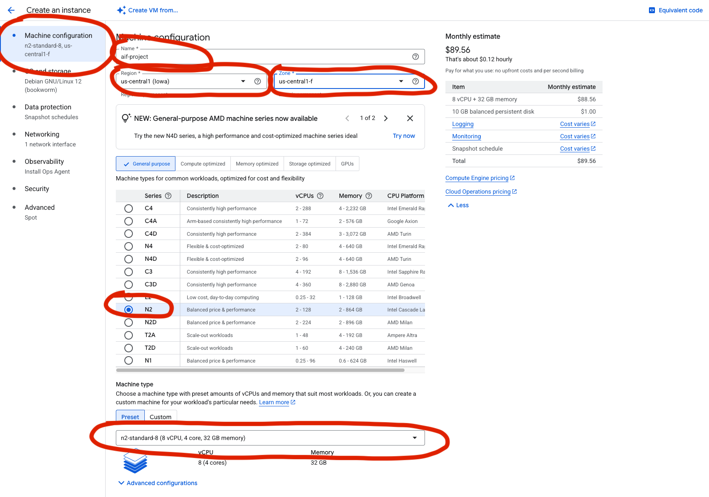
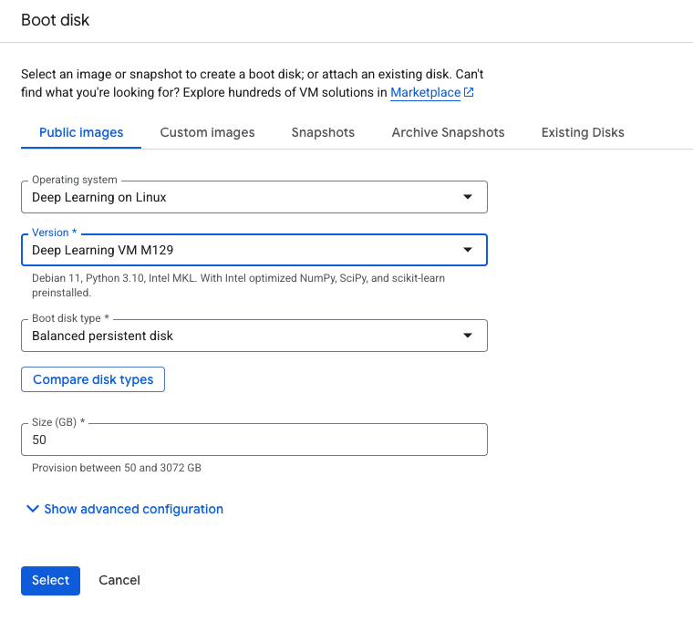
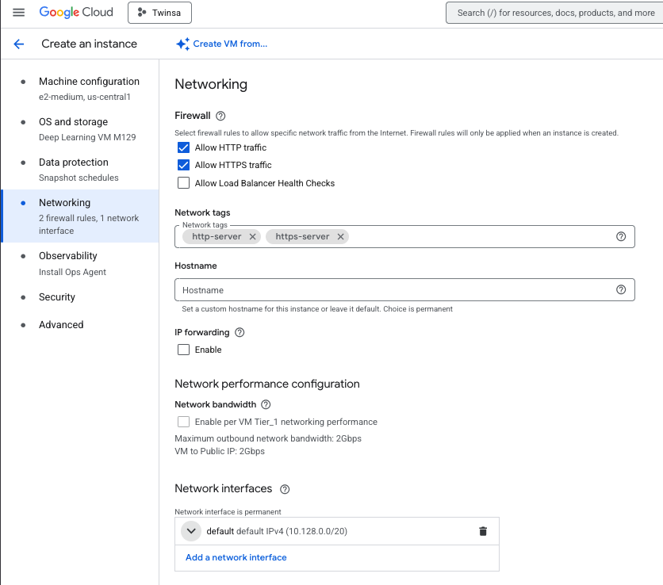
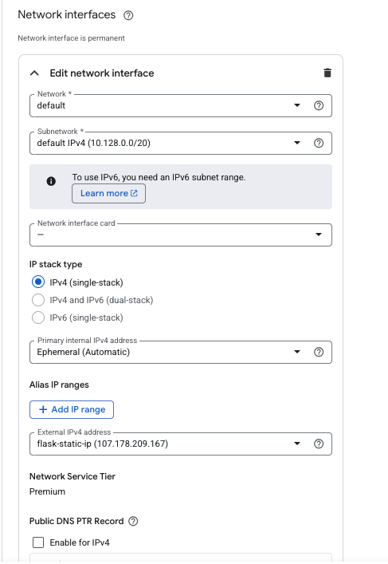
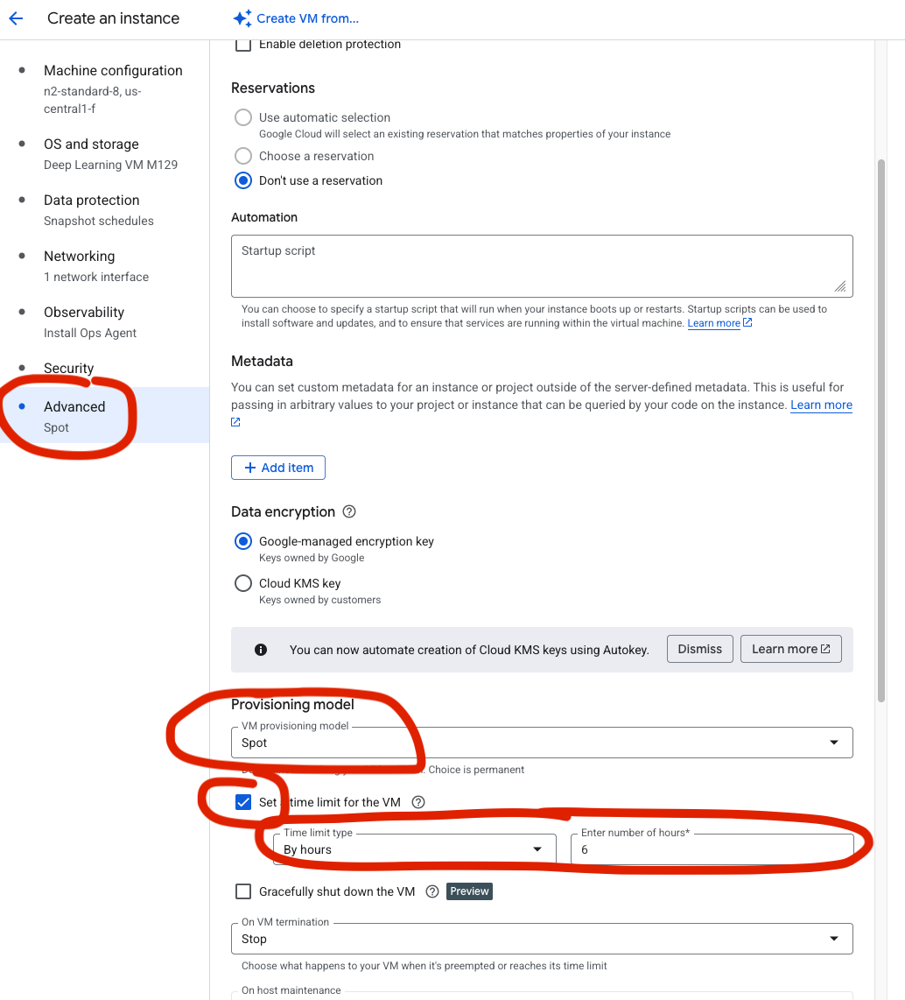
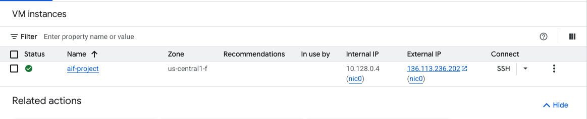

# Part 3: Deploy on Google Cloud Platform

This tutorial will guide you through deploying your dockerized Quick, Draw! application (API + Gradio interface) to Google Cloud Platform.

## Step 0: Prerequisites

Make sure you have completed the Docker tutorial and have your Quick, Draw! project ready and working locally.

Test your application locally before deploying:

```bash
docker-compose up --build
```

You should be able to access:
- The Gradio interface at `http://localhost:7860`
- The API at `http://localhost:5075`

## Step 1: Google Cloud Account and Free Coupon Code

Click on the link sent by email to redeem your free coupon code (you must use your INSA mail address to redeem it).

Once you have your coupon code, go to [this link](https://console.cloud.google.com/education?pli=1) to get your credits (you will need a Google account; if needed, you can create one using your INSA mail address).


## Step 2: Create a New Instance

On the GCloud homepage, click on the sidebar menu on the left and select **"Compute Engine"** → **"VM instances"**.



Then click on the **"Create project"** button and create a project named **aif-project**. No need to fill in the other fields.



You should arrive at a page asking you to enable the API. Click on **"Enable API"**.



You should now see a page proposing to create a new instance. Click on **"Create instance"**.


Fill in the following fields in the **Machine configuration** section:

- **Name**: `quickdraw-instance` (or any name you prefer)
- **Region**: `us-central1`
- **Zone**: `us-central1-f`
- **Machine type**: `n2-standard-8` (2 vCPU, 4 GB memory)



Then in the **OS and Storage** section, click on the **"Change"** button and select **"Deep Learning on Linux"** and select the first option:


Set the **Boot disk size** to at least **50 GB**.



Then in the **Networking** section:



Under **Network interfaces**, click the ▾ arrow next to **default default IPv4 (10.128.0.0/20)**



Find **External IPv4 address dropdown** and select **Reserve static address**. Give it a name like `quickdraw-static-ip` and click on **Reserve**.

We will also use **spot instances** to save money. Spot instances are available at a lower price than on-demand instances but are not guaranteed to be available. They can be interrupted at any time.

On the **Advanced** section, check the **"Spot"** option to use spot instances.



Finally, click on the **"Create"** button to create the instance.

## Step 3: Install the GCloud SDK on Your Local Machine

**From now on, disable the VPN or don't connect to eduroam network. It will block gcloud.**

Install the GCloud SDK on your local machine. Follow the instructions [here](https://cloud.google.com/sdk/docs/install).

Once the GCloud SDK is installed, run the following command to initialize it:

```bash
gcloud init
```

This will guide you through the process of setting up your GCloud SDK. You will need to:
- Authenticate with your Google account
- Set a default project (AIF in our case)
- No need to set a default region

## Step 4: Connect to Your Instance

Once your instance is created, you can find its name in the VM instances list on the Google Cloud Platform console.



You can connect to it using the following command:

```bash
gcloud compute ssh --zone "us-central1-f" "quickdraw-instance"
```

If your instance name or zone are different, replace them accordingly:

```bash
gcloud compute ssh --zone "your-zone" "your-instance-name"
```

You can also get the exact command by clicking on the arrow next to the **"SSH"** button in the Google Cloud Platform console and then **"view gcloud command"**.

You should now be connected to your instance and see its terminal.

## Step 5: Install Docker on the Instance

On the instance terminal, run the following commands to install Docker and Docker Compose:

```bash
sudo apt-get update
sudo curl -SL https://github.com/docker/compose/releases/download/v2.40.3/docker-compose-linux-x86_64 -o /usr/local/bin/docker-compose
sudo chmod +x /usr/local/bin/docker-compose
sudo systemctl start docker
sudo systemctl enable docker
```

Verify Docker is installed correctly:

```bash
sudo docker --version
sudo docker-compose --version
```

## Step 6: Configure Firewall Rules

On your local machine terminal (not on the instance), run the following commands to allow incoming traffic on ports 5075 (API) and 7860 (Gradio):

```bash
gcloud compute firewall-rules create allow-quickdraw-api --allow tcp:5075
gcloud compute firewall-rules create allow-quickdraw-gradio --allow tcp:7860
```

## Step 7: Prepare Your Local Project

Make sure your local *Quick, Draw!* project has the following structure:

```
Quick_Draw_Vision_Project/
├── Dockerfile
├── Dockerfile-frontend
├── docker-compose.yml
├── requirements-api.txt
├── requirements-frontend.txt
├── model.py
├── api.py
├── frontend.py
├── weights/
│   └── your_exp_name_net.pth
└── (other files from your project)
```

## Step 8: Deploy by Copying Files Directly

We will now deploy our application by copying the files to the instance.

On the instance terminal, run the following command to get your current working directory:

```bash
pwd
```

This gives you the path to the home directory of the user on the instance. You should see something like `/home/your_username`.

Now on a **separate terminal on your local machine**, navigate to your Quick, Draw! project directory and run the following command to send the folder to the instance:

```bash
gcloud compute scp --recurse --zone "us-central1-f" "." "quickdraw-instance":/home/your_username/quickdraw-app
```

Remember to replace:
- `us-central1-f` with the actual zone if different
- `quickdraw-instance` with your actual instance name if different
- `your_username` with your actual username on the instance

Then on the instance terminal, go to the folder:

```bash
cd quickdraw-app
```

Now start the application using docker-compose:

```bash
sudo docker-compose up -d
```

The `-d` flag runs the containers in detached mode (in the background).

Now go to the Google Cloud Platform console to get the **external IP address** of your instance.

You should now be able to access:
- The Gradio interface at `http://your_instance_ip:7860`
- The API at `http://your_instance_ip:5075`
- The API documentation at `http://your_instance_ip:5075/docs`

Test the Gradio interface by drawing something and checking if it gets predicted correctly.

If you want to make changes to your application, simply modify the files on your local machine and repeat the `gcloud compute scp` command to copy the updated files to the instance. Then restart the containers:

```bash
sudo docker-compose down
sudo docker-compose up -d
```

## Step 9: Deploy Using Docker Hub (Recommended)

Instead of copying files or transferring large Docker images, we can use **Docker Hub** as a registry. This is the most professional approach and is commonly used in production environments.

### 9.1: Create a Docker Hub Account

1. Go to [Docker Hub](https://hub.docker.com/) and create a free account
2. Verify your email address
3. Remember your Docker Hub username (you'll need it)

### 9.2: Login to Docker Hub Locally

On your local machine, login to Docker Hub:

```bash
docker login
```

Enter your Docker Hub username and password when prompted.

### 9.3: Build and Tag Your Images

Build your Docker images with your Docker Hub username as a prefix:

```bash
# Build API image
docker build --platform=linux/amd64 -f Dockerfile -t your_dockerhub_username/quickdraw-api:latest .

# Build Frontend image
docker build --platform=linux/amd64 -f Dockerfile-frontend -t your_dockerhub_username/quickdraw-frontend:latest .
```

**Important:** Replace `your_dockerhub_username` with your actual Docker Hub username. The `--platform=linux/amd64` flag ensures compatibility with the GCP instance (especially important for Mac users with M chips).

### 9.4: Push Images to Docker Hub

Push your images to Docker Hub:

```bash
docker push your_dockerhub_username/quickdraw-api:latest
docker push your_dockerhub_username/quickdraw-frontend:latest
```

This may take a few minutes depending on your internet speed and image size.

### 9.5: Update docker-compose.yml

Update your `docker-compose.yml` to use the images from Docker Hub instead of building locally:

```yaml
version: '3.8'

services:
  api:
    image: your_dockerhub_username/quickdraw-api:latest
    ports:
      - "5075:5075"

  gradio-app:
    image: your_dockerhub_username/quickdraw-frontend:latest
    ports:
      - "7860:7860"
    depends_on:
      - api
    environment:
      - API_URL=http://api:5075
```

**Important:** Replace `your_dockerhub_username` with your actual Docker Hub username.

### 9.6: Deploy to GCP Instance

Now we only need to transfer the `docker-compose.yml` file to the instance:

```bash
gcloud compute scp --zone "us-central1-f" docker-compose.yml quickdraw-instance:/home/your_username/
```

### 9.7: Run on the Instance

Connect to your instance:

```bash
gcloud compute ssh --zone "us-central1-f" "quickdraw-instance"
```

Pull and run the containers:

```bash
# Pull the images from Docker Hub
sudo docker-compose pull

# Or individually: 
# sudo docker pull your_dockerhub_username/quickdraw-api:latest
# sudo docker pull your_dockerhub_username/quickdraw-frontend:latest

# Start the application
sudo docker-compose up -d
```

Check that the containers are running:

```bash
sudo docker-compose ps
```

Your application should now be accessible at:
- The Gradio interface at `http://your_instance_ip:7860`
- The API at `http://your_instance_ip:5075`

### 9.8: Updating Your Application

When you make changes to your application, follow these steps:

1. **On your local machine**, rebuild and push the updated images:

```bash
# Rebuild images
docker build --platform=linux/amd64 -f Dockerfile -t your_dockerhub_username/quickdraw-api:latest .
docker build --platform=linux/amd64 -f Dockerfile-frontend -t your_dockerhub_username/quickdraw-frontend:latest .

# Push to Docker Hub
docker push your_dockerhub_username/quickdraw-api:latest
docker push your_dockerhub_username/quickdraw-frontend:latest
```

2. **On the instance**, pull the new images and restart:

```bash
sudo docker-compose down
sudo docker-compose pull
sudo docker-compose up -d
```

### 9.9: Why Use Docker Hub?

Using Docker Hub as a container registry provides several advantages:

- **Efficiency**: No need to transfer large tar files or source code
- **Version control**: Keep track of different image versions with tags
- **Collaboration**: Easy to share images with team members
- **CI/CD ready**: Can be integrated into automated deployment pipelines
- **Professional standard**: This is how most production systems work

### 9.10: Commit Your Changes

Don't forget to commit your updated `docker-compose.yml`:

```bash
git add docker-compose.yml
git commit -m "Update docker-compose to use Docker Hub images"
git push origin main
```

## Step 10: Troubleshooting

Here are common issues you might encounter and their solutions:

### Firewall Issues

**Problem:** Cannot access the application via external IP.

**Solution:**

- Verify the firewall rules were created: `gcloud compute firewall-rules list`
- Make sure the rules allow tcp:5075 and tcp:7860
- Check if the containers are running on the instance: `sudo docker-compose ps`

### SSH Connection Problems

**Problem:** Cannot SSH into the instance.

**Solution:**

- Verify the instance is running in the GCP console
- Check your zone is correct (should be `us-central1-f`)
- Try adding `--verbosity=debug` to the SSH command to see detailed error messages
- Make sure your gcloud SDK is authenticated: `gcloud auth list`

### Docker Issues

**Problem:** Docker commands fail or containers don't start.

**Solution:**

- Verify Docker is installed: `sudo docker --version`
- Check Docker service status: `sudo systemctl status docker`
- View container logs: `sudo docker-compose logs`
- Restart Docker service: `sudo systemctl restart docker`
- Check disk space: `df -h` (Docker images can take a lot of space)

### Port Already in Use

**Problem:** Error message "Address already in use" when starting containers.

**Solution:**

- Stop all running containers: `sudo docker-compose down`
- Check if processes are using the ports: `sudo lsof -i :5075` and `sudo lsof -i :7860`
- Kill the processes if needed: `sudo kill -9 <PID>`

### Docker Hub Authentication

**Problem:** Cannot push to Docker Hub or access denied.

**Solution:**

- Make sure you're logged in: `docker login`
- Verify your username is correct in the image tags
- Check that your images are tagged correctly: `docker images`
- Make sure your Docker Hub account is verified

### Missing Model Weights

**Problem:** API fails with "model file not found" error.

**Solution:**

- Make sure the `weights/` directory and model file exist in your local project
- Verify the model path in `Dockerfile` matches your actual file location
- Check that gdown successfully downloaded the weights during Docker build
- Verify the Google Drive file ID is correct and the file is publicly accessible

### Containers Don't Communicate

**Problem:** Gradio interface cannot connect to the API.

**Solution:**

- Verify both containers are running: `sudo docker-compose ps`
- Check the API URL in `frontend.py` uses the environment variable
- Make sure the `depends_on` directive is in the `docker-compose.yml`
- Check logs for both services: `sudo docker-compose logs`

### Out of Disk Space

**Problem:** Cannot build images or load images due to insufficient disk space.

**Solution:**

- Remove unused Docker resources: `sudo docker system prune -a`
- Check disk usage: `df -h`
- Remove old images: `sudo docker image prune -a`
- Consider increasing the instance's disk size in GCP console

### Platform Architecture Issues

**Problem:** Container crashes with "exec format error" on GCP.

**Solution:**

- Make sure you built with `--platform=linux/amd64` flag
- Rebuild your images with the correct platform flag
- Push the new images to Docker Hub
- Pull the updated images on the instance

## Step 11: Cleanup

To clean up and avoid unnecessary charges:

On the instance terminal:

```bash
# Stop containers
sudo docker-compose down

# Remove Docker images (optional)
sudo docker image rm your_dockerhub_username/quickdraw-api:latest
sudo docker image rm your_dockerhub_username/quickdraw-frontend:latest

# Remove all unused Docker resources
sudo docker system prune -a
```

You can stop the instance from the Google Cloud Platform console. You can delete it if you want to completely remove it, but you might want to keep it configured for future use. If you choose to keep it, you can start it again later.

## Step 12: IMPORTANT - Stop the Instance When Not in Use!

**Always remember to stop the instance when you are not using it to avoid unnecessary charges.** You have a limited $50 credit, so be careful with your usage.

To stop the instance:

- Go to the GCP Console
- Navigate to Compute Engine → VM Instances
- Click the three dots next to your instance
- Click **Stop**

To start it again:

- Click the three dots next to your instance
- Click **Start**

---

Congratulations! You've successfully deployed your machine learning application to the cloud! 🎉

---

*This tutorial has been inspired by https://davidbert.github.io/AIF/developpement/gcp_docker.html*
